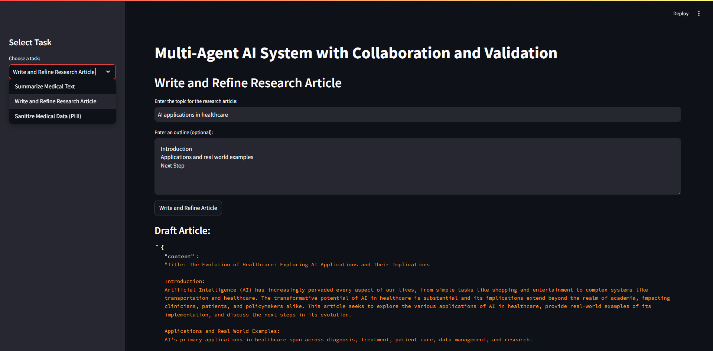

# AI Agents from Scratch




## Overview

The **Multi-Agents AI System from Scratch** is a Python-based application leveraging OpenAI's GPT-4o model to perform specialized tasks through a collaborative multi-agent architecture. Built with Streamlit for an intuitive web interface without any Agents frameworks/libraries, this system includes agents for summarizing medical texts, writing research articles, and sanitizing medical data (Protected Health Information - PHI). Each primary agent is paired with a corresponding validator agent to ensure the quality and accuracy of the outputs. Built it for beginners so they can understand that Agents can be built without orchestration frameworks like Crew AI, AutoGen, LangGraph, etc.

## Features

- **Summarize Medical Texts:** Generate concise summaries of lengthy medical documents.
- **Write Research Articles:** Create detailed research articles based on a given topic and optional outline.
- **Sanitize Medical Data (PHI):** Remove sensitive health information from medical datasets.
- **Quality Validation:** Each primary task is accompanied by a validator agent to assess and ensure output quality.
- **Robust Logging:** Comprehensive logging for monitoring and debugging purposes.
- **User-Friendly Interface:** Streamlit-based web app for easy interaction and task management.

## Architecture

```
+-------------------+
|       User        |
+---------+---------+
          |
          | Interacts via
          v
+---------+---------+
|    Streamlit App  |
+---------+---------+
          |
          | Sends task requests to
          v
+---------+---------+
|  Agent Manager    |
+---------+---------+
          |
          +---------------------------------------------+
          |                      |                      |
          v                      v                      v
+---------+---------+  +---------+---------+  +---------+---------+
|  Summarize Agent  |  |  Write Article    |  |  Sanitize Data    |
|  (Generates summary)| |  (Generates draft)| |  (Removes PHI)    |
+---------+---------+  +---------+---------+  +---------+---------+
          |                      |                      |
          v                      v                      v
+---------+---------+  +---------+---------+  +---------+---------+
|Summarize Validator|  | Refiner Agent      |  |Sanitize Validator |
|      Agent        |  |  (Enhances draft)  |  |      Agent        |
+---------+---------+  +---------+----------+ +----------+--------+
          |                      |                      |
          |                      |                      |
          +-----------+----------+-----------+----------+
                      |                      |
                      v                      v
                +-----+-------+        +-----+-------+
                |   Logger    |        |   Logger    |
                +-------------+        +-------------+
```

### Components Breakdown

1. **User**
   - Interacts with the system via the Streamlit web interface.
   - Selects tasks and provides input data.

2. **Streamlit App**
   - Frontend interface for user interaction.
   - Sends user requests to the Agent Manager.
   - Displays results and validation feedback.

3. **Agent Manager**
   - Central coordinator for all agents.
   - Delegates tasks to appropriate main and validator agents.

4. **Main Agents**
   - **Summarize Agent:** Generates summaries of medical texts.
   - **Write Article Agent:** Creates drafts of research articles.
   - **Sanitize Data Agent:** Removes PHI from medical data.

5. **Validator Agents**
   - **Summarize Validator Agent:** Assesses the quality of summaries.
   - **Refiner Agent:** Enhances drafts for better quality.
   - **Sanitize Validator Agent:** Ensures all PHI has been removed.

6. **Logger**
   - Records all interactions, inputs, outputs, and errors.
   - Facilitates monitoring and debugging.

## Agents

### Main Agents

- **Summarize Agent**
  - **Function:** Generates summaries of provided medical texts.
  - **Usage:** Input the text, and receive a concise summary.

- **Write Article Agent**
  - **Function:** Creates drafts of research articles based on a topic and optional outline.
  - **Usage:** Provide a topic and outline to generate an initial draft.

- **Sanitize Data Agent**
  - **Function:** Removes Protected Health Information (PHI) from medical data.
  - **Usage:** Input medical data containing PHI to receive sanitized data.

### Validator Agents

- **Summarize Validator Agent**
  - **Function:** Validates the accuracy and quality of summaries.
  - **Usage:** Receives the original text and its summary to assess quality.

- **Refiner Agent**
  - **Function:** Enhances and refines research article drafts for better clarity and coherence.
  - **Usage:** Receives a draft article and returns an enhanced version.

- **Sanitize Validator Agent**
  - **Function:** Ensures that all PHI has been removed from sanitized data.
  - **Usage:** Receives original and sanitized data to verify PHI removal.

## Logging

- **Location:** Logs are stored in the `logs/` directory.
- **Files:**
  - `multi_agent_system.log`: Contains detailed logs for monitoring and debugging.
- **Configuration:** Logging is handled using the `loguru` library, configured in `utils/logger.py`.

